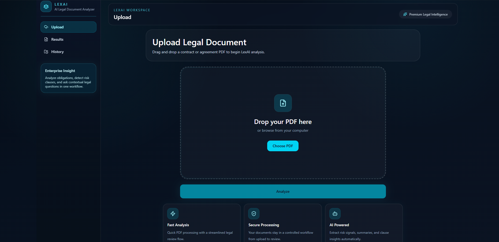
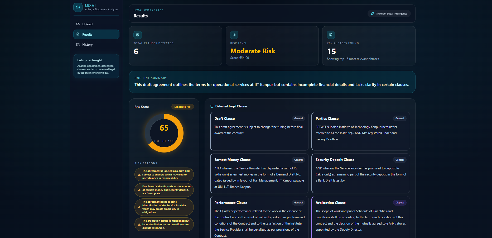
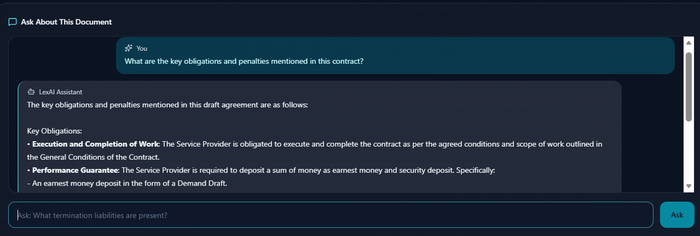
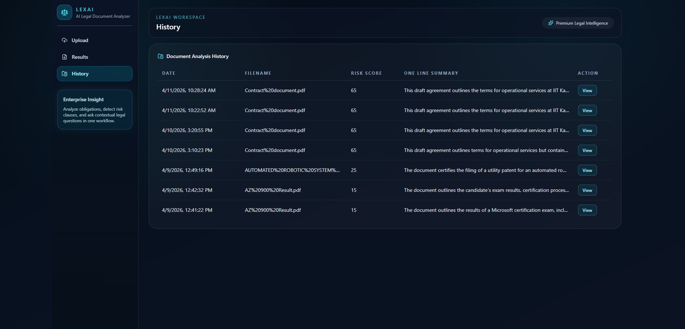

# LexAI — AI-Based Legal Document Analyzer & Summarizer


LexAI is a full-stack AI-powered SaaS web application that analyzes legal documents using Microsoft Azure cloud services. Upload any legal PDF and get instant risk scoring, clause detection, AI summarization, and a contextual Q&A chatbot.

## Features

- PDF drag-and-drop upload
- AI Risk Scoring from 0-100 with a visual gauge
- Legal Clause Detection with color-coded cards
- Extractive Summary presented as a numbered timeline
- Key Phrase Extraction for contract review
- Document Q&A Chat powered by GPT-4o
- Analysis History stored in Cosmos DB

## Tech Stack

| Frontend | Backend | AI Services | Database |
| --- | --- | --- | --- |
| React, Vite, Tailwind CSS, Axios, React Hot Toast, Lucide React | Python 3.13, Azure Functions, Azure Blob Storage SDK, Azure Cosmos DB SDK, Azure AI Document Intelligence SDK, Azure AI Text Analytics SDK, OpenAI SDK for GitHub Models | Azure AI Document Intelligence, Azure AI Language, GitHub Models GPT-4o | Azure Cosmos DB |

## Azure Services Used

1. Azure Functions for serverless API endpoints.
2. Azure Blob Storage for storing uploaded PDFs and extracted text.
3. Azure AI Document Intelligence for PDF text extraction.
4. Azure AI Language for key phrase extraction and summary support.
5. Azure Cosmos DB for saving document analysis history and metadata.

## Project Structure

```text
LexAi/
├── backend/
│   ├── function_app.py
│   ├── host.json
│   ├── local.settings.json
│   └── requirements.txt
├── frontend/
│   ├── index.html
│   ├── package.json
│   ├── vite.config.js
│   ├── public/
│   └── src/
│       ├── App.jsx
│       ├── index.css
│       ├── main.jsx
│       └── style.css
└── README.md
```

## Setup Instructions

### Prerequisites

- Python 3.13
- Node.js 18+ or newer
- Azure Functions Core Tools v4
- An Azure subscription with the required AI and storage resources

### 1. Clone the repository

```bash
git clone <your-repo-url>
cd LexAi
```

### 2. Backend setup

```bash
cd backend
python -m venv .venv
.venv\Scripts\activate
pip install -r requirements.txt
```

Create or update `local.settings.json` with these values:

- `AzureWebJobsStorage`
- `AZURE_STORAGE_CONNECTION_STRING`
- `AZURE_STORAGE_CONTAINER_NAME`
- `DOCUMENT_INTELLIGENCE_ENDPOINT`
- `DOCUMENT_INTELLIGENCE_KEY`
- `AZURE_LANGUAGE_ENDPOINT`
- `AZURE_LANGUAGE_KEY`
- `AZURE_OPENAI_KEY`
- `AZURE_OPENAI_DEPLOYMENT_NAME`
- `COSMOS_ENDPOINT`
- `COSMOS_KEY`
- `COSMOS_DATABASE_NAME`
- `COSMOS_CONTAINER_NAME`

Run the backend locally:

```bash
func start
```

### 3. Frontend setup

Open a new terminal:

```bash
cd frontend
npm install
npm run dev
```

If needed, set `VITE_API_BASE_URL` in the frontend environment to point to the local Functions endpoint.

### 4. Production build

```bash
cd frontend
npm run build
```

## Screenshots

Add screenshots below to showcase the project in your report or resume portfolio.

### Upload Screen



### Results Dashboard



### Chat Interface



### History View



## Summary

LexAI demonstrates a complete Azure-based legal document analysis workflow with AI extraction, summarization, historical persistence, and conversational review.

---

Built with Azure for Students credits | College AI/ML Project
